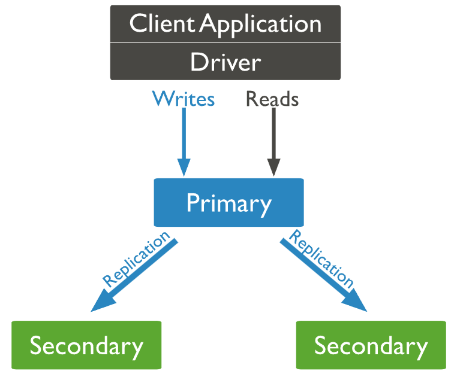
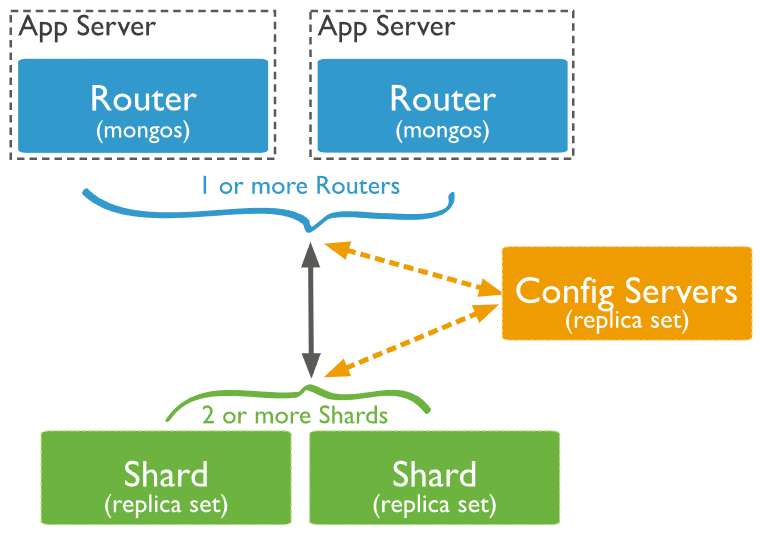

# MongoDB basics
An introduction to MongoDB, its core components, and how it structures data using documents and collections.

## What is MongoDB?

MongoDB is a popular, open-source NoSQL database that uses a **document-oriented** data model. It stores data in flexible, JSON-like documents, making it well-suited for modern web and mobile applications with evolving data requirements.

Unlike traditional relational databases, MongoDB doesn't rely on tables and rows; instead, it uses **collections of documents**, offering greater flexibility and scalability.

## Documents and Collections

### Documents

Documents are the basic units of data in MongoDB. Each document is a **JSON-like** (BSON) object that stores data as key-value pairs. A document can include:

- Strings, numbers, booleans
- Arrays
- Embedded/nested documents
- Dates and more

Example:

```json
{
  "name": "Alice",
  "age": 30,
  "email": "alice@example.com",
  "skills": ["Python", "MongoDB"],
  "address": {
    "city": "Bristol",
    "postcode": "BS1 4DJ"
  }
}
```

Documents within the same collection can have different structures, making MongoDB very flexible.


### Collections

A **collection** is a group of related documents — similar to a table in a relational database, but without enforced structure. Collections organise documents within a MongoDB database and allow for efficient querying.

Key characteristics:
- Collections store multiple documents
- Documents within a collection can have different fields and data types
- No need to define a schema before inserting data

For example, a `users` collection might contain all user profile documents in an application:


```json
[
  {
    "name": "Alice",
    "email": "alice@example.com"
  },
  {
    "username": "bob42",
    "joined": "2023-07-01",
    "isActive": true
  }
]
```


## MongoDB Architecture

### What are Replica Sets?
Replica Sets are groups of MongoDB servers that maintain the same data, providing redundancy and high availability.

### How do they work?

- One primary node receives all write operations.
- Multiple secondary nodes replicate data from the primary asynchronously.
- If the primary fails, an election process promotes a secondary to primary, ensuring continued availability.



### Advantages and Disadvantages

| Advantages                      | Disadvantages                  |
| -------------------------------| ------------------------------|
| High availability and redundancy | Replication lag possible       |
| Automatic failover              | More complex to manage         |
| Data durability                | Increased resource usage       |


### What is Sharding?

Sharding is MongoDB’s method of horizontally scaling by distributing data across multiple servers (shards).

### How does it work in MongoDB specifically?

- Data is partitioned using a shard key.
- Each shard holds a subset of the data.
- A query router (mongos) directs operations to the appropriate shard(s).
- Balancer process redistributes data to maintain an even load.



### Advantages and Disadvantages

| Advantages                     | Disadvantages                   |
| ------------------------------| -------------------------------|
| Scales data across many servers | Shard key selection is critical |
| Handles large data volumes     | Increased operational complexity |
| Supports high throughput       | Some queries can be slower if not shard-key targeted |